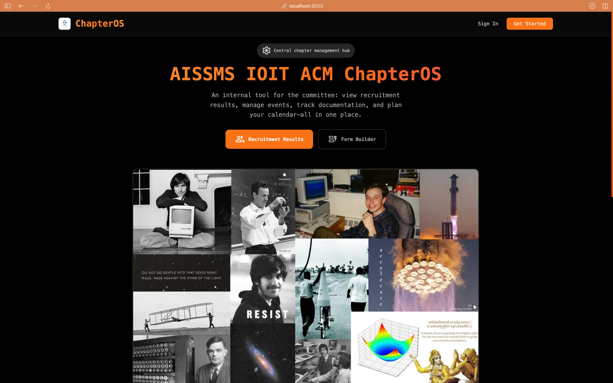
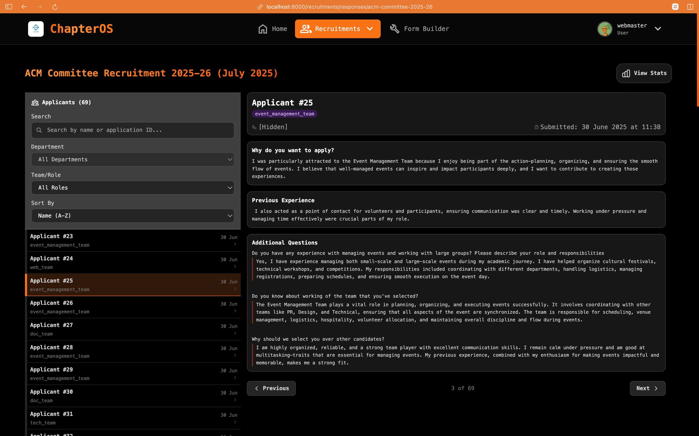
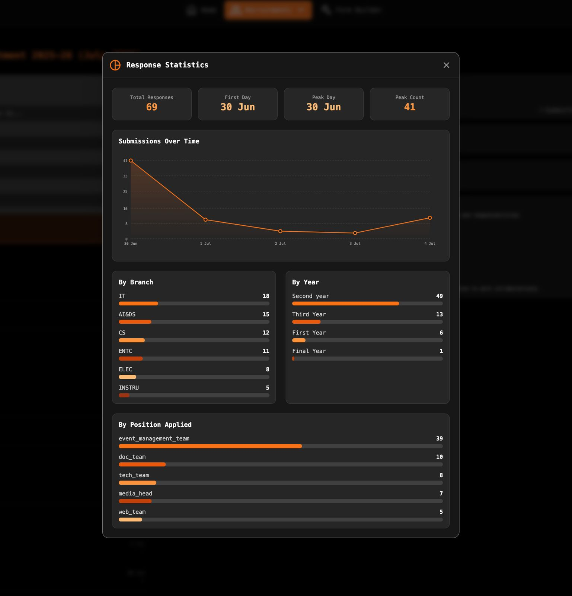

# ChapterOS - AISSMS IOIT ACM Internal Dashboard

ChapterOS is the central management hub for the AISSMS IOIT ACM Student Chapter. It's an internal web application designed to streamline committee operations, from managing recruitment and analyzing statistics to planning events and maintaining documentation and annual events calender.

**Landing Page**


**Recruitment Dashboard**


**Response Statistics**


**Application Architecture**


## Apps

- `recruitments`: Manage and analyze data from member recruitment drives.
- `form_builder`: Create custom forms for event registrations, feedback, surveys and events.
- `documentation`: A central repository for all chapter-related documents, reports, and assets.
- `events`: Plan, track, and manage all chapter events, workshops, and speaker sessions.
- `users`: Manage committee member profiles, roles, and internal permissions.
- _and more comming soon..._

## Tech Stack

- **Backend:** Django, Python
- **Frontend:** HTML, Tailwind CSS, Vanilla JavaScript, Alpine.js
- **Database:** MySQL
- **Deployment:** Gunicorn / Passenger

## Development Setup

Choose one of the following methods to set up your local development environment. The Docker method is recommended for a quick and consistent database setup.

### Option 1: Docker for Database (Recommended)

This method uses Docker to run the MySQL database and phpMyAdmin, while you run the Django application locally on your machine.

#### Prerequisites

- Python 3.6.8
- Node.js and npm
- Docker and Docker Compose

#### 1. Clone the Repository

```bash
git clone https://github.com/IOIT-ACM/ChapterOS.git
cd ChapterOS
```

#### 2. Start Database Services

This command starts the MySQL database and phpMyAdmin services in the background using the configuration in `docker-compose.yml`.

```bash
docker-compose up -d
```

#### 3. Setup Local Environment

A `Makefile` is provided to simplify the setup process. This command will create a Python virtual environment, install all Python and Node.js dependencies, and create a `.env` file from the example.

```bash
make setup
```

#### 4. Configure Environment Variables

The `make setup` command creates a `.env` file. Open it and ensure it has the following configuration to connect your local Django application to the Docker database.

```ini
# .env
DB_HOST=127.0.0.1
DB_NAME=chapteros_db
DB_USER=chapteros_user
DB_PASSWORD=chapteros_password

# Django Settings
DEBUG=True
SECRET_KEY=your-super-secret-key-here
```
The database credentials must match those in `docker-compose.yml`.

#### 5. Run Initial Database Migrations

With the database running in Docker and your local environment ready, apply the migrations.

```bash
# Make sure your virtual environment is active
source venv/bin/activate

python3 manage.py migrate
```

#### 6. Create a Superuser

To access the Django Admin panel (`/admin/`), you need to create a superuser account.

```bash
python3 manage.py createsuperuser
```

Follow the prompts to create your admin account.

#### 7. Running the Application

For development, you need to run two processes in separate terminal windows.

1.  **Start the Django Development Server**
    This runs the backend on `http://127.0.0.1:8000/`.

    ```bash
    make run
    # Or manually: python3 manage.py runserver
    ```

2.  **Start the Tailwind CSS Watcher**
    This watches for changes in your template and CSS files and automatically rebuilds the stylesheet.

    ```bash
    npm run watch
    ```

#### 8. Access Your Services

- **Django Application:** [http://localhost:8000](http://localhost:8000)
- **phpMyAdmin (Database GUI):** [http://localhost:8080](http://localhost:8080)
  - **Server:** `db`
  - **Username:** `root`
  - **Password:** `root_password_123`

#### Managing Docker Containers

To stop the database and phpMyAdmin services when you are done:
```bash
docker-compose down
```

---

### Option 2: Manual Setup

This method requires you to install and manage a MySQL server directly on your local machine.

#### Prerequisites

- Python 3.6.8
- Node.js and npm
- A running MySQL server on your local machine.

#### 1. Clone the Repository

```bash
git clone https://github.com/IOIT-ACM/ChapterOS.git
cd ChapterOS
```

#### 2. Setup the Environment

```bash
make setup
```

#### 3. Configure Environment Variables

Edit the newly created `.env` file with your local MySQL database credentials.

```ini
# .env
DB_HOST="127.0.0.1"
DB_NAME="your_db_name"
DB_USER="your_db_user"
DB_PASSWORD="your_db_password"
```

#### 4. Run Initial Database Migrations & Create Superuser

```bash
# Make sure your virtual environment is active
source venv/bin/activate

python3 manage.py migrate
python3 manage.py createsuperuser
```

#### 5. Running the Application

Follow the same steps as in the Docker guide for running the Django server and Tailwind watcher.

## ⚠️ Important: Database Migrations

Migrations are how Django tracks changes to your database schema (your `models.py` files). It is critical that all developers handle them correctly to ensure consistency.

### The Correct Workflow

1.  After you change a model (e.g., add a field to `apps/users/models.py`), run `makemigrations`. This creates a new migration file that represents your changes.
    ```bash
    python3 manage.py makemigrations
    ```
2.  Next, run `migrate` to apply this change to your local database.
    ```bash
    python3 manage.py migrate
    ```
3.  Commit both your model changes and the **newly generated migration file** to Git.

### Key Rules

- **DO NOT DELETE MIGRATION FILES.** These files are a historical record of your database schema. Deleting them can cause irreversible issues for other developers and in production. If you make a mistake, it's better to create a new migration to reverse the change.
- **ALWAYS RUN `migrate` AFTER PULLING CHANGES.** After you pull new code from the repository, always run `python3 manage.py migrate` to apply any database changes made by other developers.
- **RESOLVE MIGRATION CONFLICTS CAREFULLY.** If you encounter conflicts, ask for help. Never just delete the conflicting files. Contact webmaster while doing so.

## Building for Production

When deploying the application, you need to build the static assets and collect them into a single directory.

1.  **Build Static CSS**
    This command compiles and minifies the Tailwind CSS.

    ```bash
    npm run build
    ```

2.  **Collect Django Static Files**
    This command gathers all static files (CSS, JS, images) into the `staticfiles` directory, which is then served by WhiteNoise or your web server.
    ```bash
    python3 manage.py collectstatic
    ```
